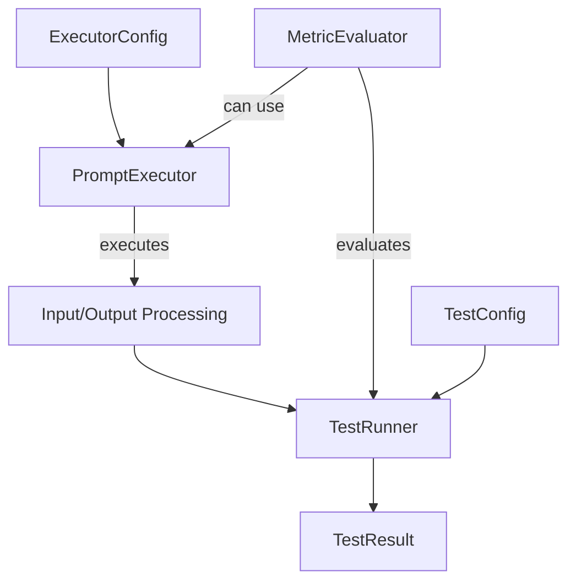

# AlloLLMEval

A framework for evaluating LLM outputs, developed by [AlloBrain](https://allobrain.com).

## Installation

You can install AlloLLMEval directly from GitHub:

```bash
pip install git+https://github.com/AlloReview/AlloLLMEval.git
```

For development installation:

```bash
git clone https://github.com/AlloReview/AlloLLMEval.git
cd AlloLLMEval
pip install -e .[dev]
```

## Development Workflow

1. **Setup Development Environment**

   ```bash
   git clone https://github.com/AlloReview/AlloLLMEval.git
   cd AlloLLMEval
   pip install -e .[dev]
   ```

2. **Code Quality Checks**

   Before submitting changes, ensure your code passes all quality checks:

   ```bash
   # Run flake8 linting
   flake8 . --count --select=E9,F63,F7,F82 --show-source --statistics
   flake8 . --count --max-complexity=10 --max-line-length=88 --statistics

   # Check formatting with black
   black --check .
   ```

   To automatically format your code:

   ```bash
   black .
   ```

3. **Making Changes**

   - Create a new branch for your changes
   - Make your changes
   - Run quality checks (above)
   - Submit a Pull Request to `main` branch

4. **Release Process**
   For maintainers to create a new release:
   ```bash
   # Tag a new version
   git tag v1.0.0  # Use semantic versioning
   git push origin v1.0.0
   ```
   This will trigger:
   - Test workflow
   - GitHub Release creation

## CI/CD Pipeline

The project uses GitHub Actions for continuous integration and deployment. The pipeline includes:

### Testing Workflow

- Runs on every push to `main` branch and pull requests
- Tests across multiple Python versions (3.6, 3.7, 3.8, 3.9)
- Performs the following checks:
  - Installation of dependencies
  - Code linting with flake8
  - Code formatting verification with black

### Publishing Workflow

- Triggered when a version tag (v\*) is pushed
- Runs only after successful test completion
- Builds and publishes package to PyPI
- Requirements:
  - PyPI credentials configured as repository secrets
  - Version tag following semantic versioning (e.g., v1.0.0)

## System Overview

A flexible testing system for Language Models and arbitrary functions that enables:

- Evaluation of prompt stability across different configurations
- Comparison with reference models/systems
- Validation against ground truth
- Rule-based compliance checking



## Core Concepts

### 1. PromptExecutor

An execution unit that processes inputs with configurable parameters.

```python
from typing import TypeVar, Generic, Dict, Any
from dataclasses import dataclass
from enum import Enum
from datetime import datetime

InputType = TypeVar('InputType')
OutputType = TypeVar('OutputType')
ExecutorConfig = Dict[str, Any]

class PromptExecutor(Generic[InputType, OutputType]):
    """Base class for all execution units"""
    def __init__(self, config_schema: Dict[str, Any]):
        self.config_schema = config_schema

    def execute(self, input_data: InputType, config: ExecutorConfig) -> OutputType:
        raise NotImplementedError

# Example implementation
class ClassificationExecutor(PromptExecutor[Dict[str, str], Dict[str, Any]]):
    def execute(self, input_data: Dict[str, str], config: ExecutorConfig) -> Dict[str, Any]:
        model = config.get("model", "gpt-4")
        return {
            "class": self._classify_with_model(input_data["text"], model),
            "confidence": 0.95,
            "model_used": model
        }
```

### 2. MetricEvaluator

Evaluates outputs and can execute additional runs for comparison.

```python
class MetricStatus(Enum):
    PASSED = "passed"
    WARNING = "warning"
    FAILED = "failed"
    INCONCLUSIVE = "inconclusive"

@dataclass
class MetricOutput:
    score: float  # 0-1 score
    status: MetricStatus
    visualization: Any  # Plot, table, etc.
    details: Dict[str, Any]
    threshold: Dict[str, float]

class MetricEvaluator:
    """Base class for metric evaluation"""
    def __init__(self, config: Dict[str, Any]):
        self.config = config

    def evaluate(
        self,
        executor: PromptExecutor,
        input_data: Any,
        base_output: Any,
        executor_config: Dict[str, Any],
        test_config: Dict[str, Any],
        evaluation_params: Dict[str, Any]
    ) -> MetricOutput:
        raise NotImplementedError
```

### 3. TestRunner

Coordinates execution and evaluation.

```python
@dataclass
class TestConfig:
    """Configuration for test execution"""
    executor_config: ExecutorConfig
    metric_config: Dict[str, Any]

@dataclass
class TestResult:
    """Test execution results"""
    metric_output: MetricOutput
    executor_output: Any
    configs_used: TestConfig
    metadata: Dict[str, Any]
    timestamp: datetime

class TestRunner:
    """Manages test execution and evaluation"""
    def __init__(
        self,
        executor: PromptExecutor,
        evaluator: MetricEvaluator,
        config: TestConfig
    ):
        self.executor = executor
        self.evaluator = evaluator
        self.config = config

    def run(
        self,
        input_data: Any,
        evaluation_params: Optional[Dict[str, Any]] = None,
        override_config: Optional[TestConfig] = None
    ) -> TestResult:
        effective_config = self._merge_configs(self.config, override_config)
        base_output = self.executor.execute(input_data, effective_config.executor_config)

        metric_result = self.evaluator.evaluate(
            executor=self.executor,
            input_data=input_data,
            base_output=base_output,
            executor_config=effective_config.executor_config,
            test_config=effective_config.metric_config,
            evaluation_params=evaluation_params or {}
        )

        return TestResult(
            metric_output=metric_result,
            executor_output=base_output,
            configs_used=effective_config,
            metadata=self._get_metadata(),
            timestamp=datetime.now()
        )
```

## Use Cases & Examples

### 1. Model Comparison Testing

Comparing outputs between different model sizes.

```python
class LargeModelComparisonEvaluator(MetricEvaluator):
    def evaluate(
        self,
        executor: PromptExecutor,
        input_data: Any,
        base_output: Any,
        executor_config: Dict[str, Any],
        test_config: Dict[str, Any],
        evaluation_params: Dict[str, Any]
    ) -> MetricOutput:
        # Run with larger model
        large_model_config = test_config["large_model_config"]
        large_model_output = executor.execute(input_data, large_model_config)

        # Compare outputs
        similarity_score = self._calculate_similarity(base_output, large_model_output)
        comparison_viz = self._create_comparison_viz(base_output, large_model_output)

        return MetricOutput(
            score=similarity_score,
            status=self._determine_status(similarity_score),
            visualization=comparison_viz,
            details={
                "base_model": executor_config["model"],
                "reference_model": large_model_config["model"],
                "outputs": {
                    "base": base_output,
                    "reference": large_model_output
                }
            },
            threshold={"min_similarity": 0.8}
        )

# Usage
comparison_test = TestRunner(
    executor=ClassificationExecutor(config_schema={}),
    evaluator=LargeModelComparisonEvaluator({}),
    config=TestConfig(
        executor_config={"model": "gpt-4-mini"},
        metric_config={
            "large_model_config": {"model": "gpt-4"}
        }
    )
)

result = comparison_test.run({"text": "Sample input"})
```

### 2. Stability Testing

Testing output stability across configurations.

```python
class StabilityEvaluator(MetricEvaluator):
    def evaluate(
        self,
        executor: PromptExecutor,
        input_data: Any,
        base_output: Any,
        executor_config: Dict[str, Any],
        test_config: Dict[str, Any],
        evaluation_params: Dict[str, Any]
    ) -> MetricOutput:
        # Run with comparison configs
        comparison_outputs = []
        for config in test_config["comparison_configs"]:
            output = executor.execute(input_data, config)
            comparison_outputs.append(output)

        stability_score = self._calculate_stability([base_output] + comparison_outputs)
        stability_viz = self._create_stability_plot(comparison_outputs)

        return MetricOutput(
            score=stability_score,
            status=self._get_status(stability_score),
            visualization=stability_viz,
            details={"outputs": comparison_outputs},
            threshold={"min_stability": 0.7}
        )

# Usage
stability_test = TestRunner(
    executor=ClassificationExecutor(config_schema={}),
    evaluator=StabilityEvaluator({}),
    config=TestConfig(
        executor_config={"model": "gpt-4"},
        metric_config={
            "comparison_configs": [
                {"model": "gpt-4", "temperature": 0.1},
                {"model": "gpt-4", "temperature": 0.9}
            ]
        }
    )
)
```

### 3. Rule Compliance Testing

Checking if outputs follow specific rules.

```python
class RuleComplianceEvaluator(MetricEvaluator):
    def evaluate(
        self,
        executor: PromptExecutor,
        input_data: Any,
        base_output: Any,
        executor_config: Dict[str, Any],
        test_config: Dict[str, Any],
        evaluation_params: Dict[str, Any]
    ) -> MetricOutput:
        rules = test_config["rules"]
        rule_results = {}

        for rule in rules:
            compliance_score = self._check_rule(
                input_data,
                base_output,
                rule
            )
            rule_results[rule] = compliance_score

        return MetricOutput(
            score=min(rule_results.values()),
            status=self._get_overall_status(rule_results),
            visualization=self._create_rule_compliance_viz(rule_results),
            details={"rule_results": rule_results},
            threshold={"min_compliance": 0.9}
        )

# Usage
rule_test = TestRunner(
    executor=ClassificationExecutor(config_schema={}),
    evaluator=RuleComplianceEvaluator({}),
    config=TestConfig(
        executor_config={"model": "gpt-4"},
        metric_config={
            "rules": [
                "output_must_match_input_context",
                "confidence_must_be_justified"
            ]
        }
    )
)
```

### 4. Ground Truth Testing

Comparing outputs against known correct answers.

```python
class GroundTruthEvaluator(MetricEvaluator):
    def evaluate(
        self,
        executor: PromptExecutor,
        input_data: Any,
        base_output: Any,
        executor_config: Dict[str, Any],
        test_config: Dict[str, Any],
        evaluation_params: Dict[str, Any]
    ) -> MetricOutput:
        # Get ground truth from evaluation params
        ground_truth = evaluation_params.get("ground_truth")
        if not ground_truth:
            raise ValueError("Ground truth must be provided in evaluation_params")

        # Calculate accuracy/similarity to ground truth
        accuracy_score = self._calculate_accuracy(base_output, ground_truth)

        # Create detailed comparison
        comparison_details = self._compare_with_ground_truth(
            base_output,
            ground_truth
        )

        # Generate visualization
        comparison_viz = self._create_comparison_viz(
            base_output,
            ground_truth,
            comparison_details
        )

        return MetricOutput(
            score=accuracy_score,
            status=self._determine_status(accuracy_score),
            visualization=comparison_viz,
            details={
                "ground_truth": ground_truth,
                "model_output": base_output,
                "comparison": comparison_details
            },
            threshold={
                "high_accuracy": 0.95,
                "acceptable_accuracy": 0.8
            }
        )

    def _calculate_accuracy(self, output: Any, ground_truth: Any) -> float:
        if isinstance(output, dict) and isinstance(ground_truth, dict):
            return self._calculate_dict_similarity(output, ground_truth)
        elif isinstance(output, str) and isinstance(ground_truth, str):
            return self._calculate_string_similarity(output, ground_truth)
        else:
            return float(output == ground_truth)

# Usage
ground_truth_test = TestRunner(
    executor=ClassificationExecutor(config_schema={}),
    evaluator=GroundTruthEvaluator({}),
    config=TestConfig(
        executor_config={"model": "gpt-4"},
        metric_config={
            "accuracy_threshold": 0.8,
            "similarity_metric": "exact_match"
        }
    )
)

# Test with multiple inputs and their corresponding ground truths
test_cases = [
    {
        "input": {"text": "This is a positive review"},
        "ground_truth": {"class": "positive", "confidence": 0.9}
    },
    {
        "input": {"text": "This is a negative review"},
        "ground_truth": {"class": "negative", "confidence": 0.85}
    }
]

results = []
for case in test_cases:
    result = ground_truth_test.run(
        input_data=case["input"],
        evaluation_params={"ground_truth": case["ground_truth"]}
    )
    results.append(result)

# Analyze results
for i, result in enumerate(results):
    print(f"Test case {i+1}:")
    print(f"Accuracy: {result.metric_output.score}")
    print(f"Status: {result.metric_output.status}")
    print("Details:", result.metric_output.details)
    display(result.metric_output.visualization)
```
